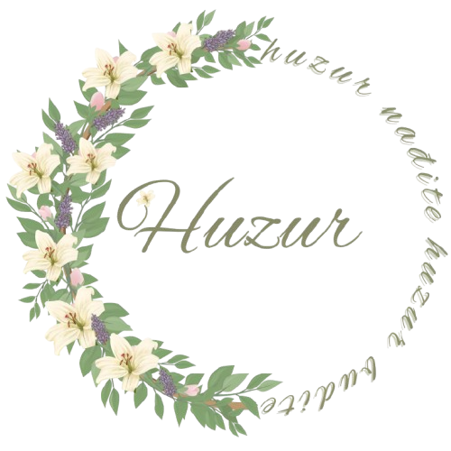

# Huzur Mostar - Flower Shop Website

<div align="center">
  
</div>

[](https://app.netlify.com/sites/huzurmostar-in-progress/deploys)
[](https://github.com/Velid-387/huzur-mostar/actions/workflows/angular-test.yml)

## Continuous Integration

This project uses GitHub Actions for continuous integration. Every time code is pushed or a pull request is created:

1. All unit tests are automatically run
2. Code coverage reports are generated
3. The application is built to verify there are no build errors
4. Status comments are added to pull requests
5. When code is merged to main/master, it triggers an automatic deployment

To see test results, check the "Actions" tab in the GitHub repository.

## About The Project

Huzur Mostar is a modern, responsive website for a flower shop based in Mostar, Bosnia and Herzegovina. The site showcases the shop's products, services, and brand essence, providing visitors with a seamless experience to explore floral arrangements and connect with the business.

The name "Huzur" represents peace and tranquility in all aspects of life - reflecting the shop's philosophy that beautiful floral arrangements can bring harmony and joy to people's lives.

## Features

- **Responsive Design** - Optimized for all device sizes from mobile to desktop
- **Single Page Application** - Smooth scrolling between sections
- **Dark/Light Mode** - Toggle between color themes
- **Animated Elements** - Subtle animations enhance user experience
- **Product Showcase** - Display of floral arrangements with images and descriptions
- **Contact Form** - Easy way for customers to reach out
- **Social Media Integration** - Links to Instagram, Facebook and location
- **FAQ Section** - Answers to common customer questions
- **Testimonials** - Customer reviews and feedback

## Technology Stack

- **Frontend Framework**: Angular 17+
- **Styling**: Custom CSS with responsive design principles
- **Animations**: CSS animations and Angular animation services
- **Icons**: Font Awesome

## Getting Started

### Prerequisites

- Node.js (v16+)
- npm (v8+)
- Angular CLI

### Installation

1. Clone the repository
   ```bash
   git clone https://github.com/yourusername/huzur-mostar.git
   cd huzur-mostar
   ```

2. Install dependencies
   ```bash
   npm install
   ```

3. Start the development server
   ```bash
   ng serve
   ```

4. Open your browser and navigate to `http://localhost:4200/`

## Project Structure

```
huzur-mostar/
├── src/                    # Source files
│   ├── app/                # Application components and services
│   │   ├── components/     # UI components
│   │   ├── services/       # Services for animations, scrolling, etc.
│   │   ├── app.config.ts   # App configuration
│   │   └── app.routes.ts   # Routing configuration
│   ├── assets/             # Static assets
│   │   ├── img/            # Images
│   │   └── css/            # Stylesheets
│   └── index.html          # Main HTML file
├── public/                 # Public assets
└── angular.json            # Angular configuration
```

## Building for Production

To build the project for production, run:

```bash
ng build --configuration production
```

This will create optimized production files in the `dist/` directory.

## Contact

Huzur Mostar - [Instagram](https://www.instagram.com/huzur.mostar/) - [Facebook](https://www.facebook.com/huzur.mostar)

Store Location: Maršala Tita 134, Mostar, 88000, Bosnia and Herzegovina

## License

This project is proprietary. All rights reserved.

---

Made with ❤️ for Huzur Mostar Flower Shop
